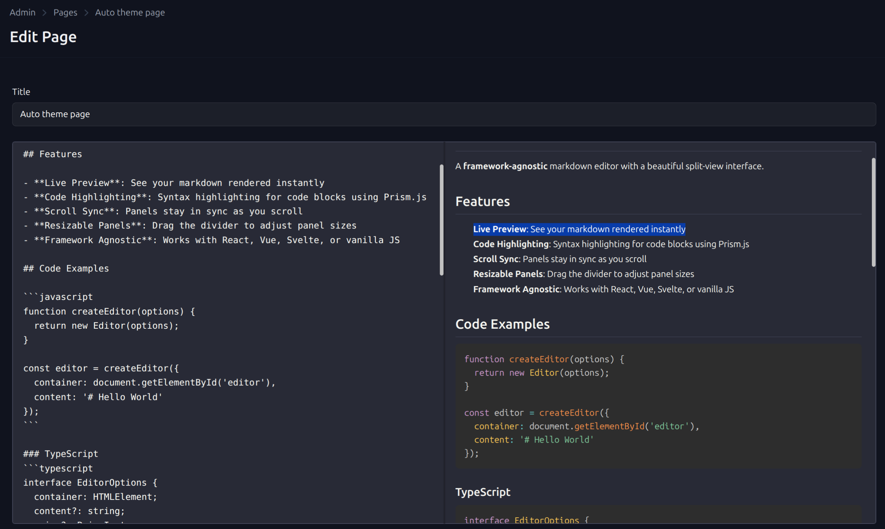

# ActiveadminMitosisEditor

A Ruby gem that provides a split-view markdown editor input for ActiveAdmin, powered by mitosis-js.



## Installation

Add this line to your Rails application's Gemfile:

```ruby
gem "activeadmin_mitosis_editor"
```

Then run `bundle install`.

## Usage

In your ActiveAdmin resource:

```ruby
ActiveAdmin.register Article do
  form do |f|
    f.inputs do
      f.input :title
      f.input :body, as: :mitosis_editor
    end
    f.actions
  end
end
```

### Editor Options

Pass serializable options to `createEditor()` via `editor_options`:

```ruby
f.input :body, as: :mitosis_editor,
  editor_options: { height: "400px", placeholder: "Write markdown...", theme: "dark" }
```

| Option | Type | Default | Description |
|--------|------|---------|-------------|
| height | string | '500px' | Editor height |
| placeholder | string | '' | Placeholder text |
| theme | string | 'light' | Theme: 'light', 'dark', or 'auto' |
| readonly | boolean | false | Make editor read-only |
| cssVars | hash | {} | Custom CSS variables |

Any key in `editor_options` is passed through to the JS `createEditor()` call.

#### Theme Examples

```ruby
# Light theme (default)
f.input :body, as: :mitosis_editor,
  editor_options: { theme: "light" }

# Dark theme
f.input :body, as: :mitosis_editor,
  editor_options: { theme: "dark" }

# Auto-detect based on system preference
f.input :body, as: :mitosis_editor,
  editor_options: { theme: "auto" }
```

### Customizing CSS

To customize CSS variables, copy the CSS files to your app:

```bash
rails generate mitosis_editor:styles
```

This creates:
- `app/assets/stylesheets/mitosis_editor/mitosis-editor.css`
- `app/assets/stylesheets/mitosis_editor/theme-light.css`
- `app/assets/stylesheets/mitosis_editor/theme-dark.css`

Edit the CSS variables in these files, then update your dependencies to use your custom CSS:

```erb
<%= stylesheet_link_tag "mitosis_editor/mitosis-editor" %>
<%= stylesheet_link_tag "mitosis_editor/theme-light" %>
<%= javascript_include_tag "mitosis-editor" %>
```

### Customizing Dependencies

By default, the gem loads its own CSS and JS. To control which scripts and stylesheets are loaded (e.g. to add Prism for syntax highlighting), copy the dependencies partial into your app:

```
rails generate mitosis_editor:views
```

This creates `app/views/inputs/mitosis_editor_input/_dependencies.html.erb` with commented-out examples for Prism CDN. Uncomment or add whatever you need:

```erb
<%= stylesheet_link_tag "mitosis-editor" %>
<%= javascript_include_tag "mitosis-editor" %>

<%= stylesheet_link_tag "https://cdn.jsdelivr.net/npm/prismjs@1.29.0/themes/prism-tomorrow.min.css" %>
<%= javascript_include_tag "https://cdn.jsdelivr.net/npm/prismjs@1.29.0/prism.min.js" %>
<%= javascript_include_tag "https://cdn.jsdelivr.net/npm/prismjs@1.29.0/components/prism-javascript.min.js" %>
```

The editor JS auto-detects `window.Prism` and passes it to `createEditor()` when present.

### JavaScript API

The editor instance is accessible via the container element and a custom event.

**Container ID** follows the pattern `mitosis-editor-{object_name}_{method}`:

```js
// For f.input :body, as: :mitosis_editor on a Post form:
const container = document.getElementById("mitosis-editor-post_body")
```

**`mitosis-editor:ready` event** — dispatched on the container when the editor finishes initializing. The editor instance is passed as `event.detail`. The event does not bubble.

```js
const container = document.getElementById("mitosis-editor-post_body")

if (container.editor) {
  // editor already initialized
  doSomething(container.editor)
} else {
  container.addEventListener("mitosis-editor:ready", e => doSomething(e.detail), { once: true })
}
```

**Editor methods:**

| Method | Description |
|--------|-------------|
| `getMarkdown()` | Returns current content as a Markdown string |
| `setMarkdown(content)` | Replaces editor content |
| `getHTML()` | Returns rendered HTML string |
| `getBoth()` | Returns `{ markdown, html }` |
| `setTheme(theme)` | Sets theme: `'light'`, `'dark'`, or `'auto'` |
| `getTheme()` | Returns current theme string |
| `destroy()` | Tears down the editor and removes its DOM |

**Adding custom scripts alongside the editor** — the `_dependencies.html.erb` partial (see [Customizing Dependencies](#customizing-dependencies)) is the right place to load additional scripts that interact with the editor, since it renders on every page that includes a mitosis editor input.

## Requirements

- Ruby >= 3.0
- Rails >= 7.0
- ActiveAdmin >= 4.0
- Formtastic >= 5.0

## Development

After checking out the repo, run `bin/setup` to install dependencies.

## Contributing

Bug reports and pull requests are welcome on GitHub.

## License

The gem is available as open source under the terms of the MIT License.
# test
